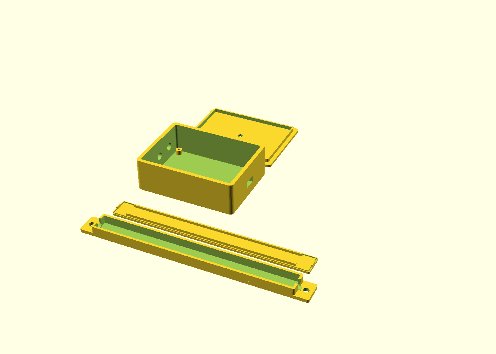

# MotoNode: Modular LED Light Design

Goal: **the lowest cost per lit module** that still survives vehicle use
(vibration, wet weather, 14.4 V charging voltage, reverse-polarity mistakes),
using only parts you can buy for cents.

---

## 1. Architecture

```
                         ┌──────────────────────── CONTROLLER ────────────────────────┐
 Battery/ignition 12V ──►│ fuse ─► reverse-pol FET ─► TVS ─► +12V_BUS ───────────────┐│
                         │                                  │                        ││
                         │                                  └► MP1584 buck ─► 5V     ││
                         │                                                  │        ││
 Brake  ─────────────────│► opto ─┐                     ESP32-C3 SuperMini ◄┘        ││
 Turn L ─────────────────│► opto ─┼──────────────────►  GPIO5/6/7                    ││
 Turn R ─────────────────│► opto ─┘                     GPIO4 ◄── mode button        ││
                         │                              GPIO10 ─► 74AHCT1G125 ─33Ω─┐ ││
                         └───────────────────────────────────────────────────────┐ │ ││
                                                                                  ▼ ▼ ▼
                                                                         3-pin  GND DATA +12V
                                                                                  │  │  │
   ┌──── MODULE 1 ────┐      ┌──── MODULE 2 ────┐                ┌──── MODULE N ────┐
   │ IN ► 8×WS2815 ►OUT│────►│ IN ► 8×WS2815 ►OUT│────► ... ────►│ IN ► 8×WS2815 ►OUT│ (cap)
   └──────────────────┘      └──────────────────┘                └──────────────────┘
```

* **One bus:** 3 wires (+12 V, GND, DATA) daisy-chained through every module.
* **Identical modules:** every module has an IN plug and an OUT plug. The firmware
  only needs to know *how many* modules there are and *what role* each plays.
* **Roles:** each module can act as `ACCENT` (effects), `LEFT` / `RIGHT`
  (sequential amber indicator), or `TAIL` (dim red running light, full red on brake).

### Why WS2815 (12 V) and not WS2812B (5 V)?

| | WS2812B (5 V) | **WS2815 (12 V)** |
|---|---|---|
| LED cost | ~$0.04 | ~$0.08–0.10 |
| Current for the same light | ~2.4× | 1× |
| Needs 5 V regulator sized for all LEDs | yes, 3–5 A buck (~$3) | **no** |
| Voltage drop over a long chain | severe, needs power injection | minor |
| One dead LED kills the rest of the chain | yes | **no** (backup data line) |
| Runs off vehicle 12 V directly | no | **yes** |

The higher LED price is cancelled out by not needing a big regulator, thicker
wire or power injection. The design is also simpler and more robust.

---

## 2. Light module

| Spec | Value |
|---|---|
| LEDs | 8 × WS2815 (5050 RGB) cut from a 60 LED/m strip |
| Size | 133 mm of LEDs (8 × 16.67 mm); housing 155 × 16.5 × 9.7 mm, plus a 10 mm mounting tab at each end |
| Supply | 12 V nominal (10–14.6 V) |
| Current | ~20 mA/LED full white → **≈160 mA/module max**, ~40 mA typical |
| Connectors | 1 × 3-pin waterproof pigtail IN (male), 1 × OUT (female) |
| Housing | 3D-printed PETG channel + frosted diffuser lid, silicone-sealed |
| Cost | **≈ $1.30** (see BOM) |

Want a different size? Change `leds_per_module` in the SCAD file and
`LEDS_PER_MODULE` in `config.h`. A 144 LED/m WS2815 strip gives a compact 56 mm
module with the same housing code (`led_pitch = 6.94`).

### Module wiring

```
 IN pigtail (male pins)              WS2815 strip piece (8 LEDs)            OUT pigtail (female)
  +12V (red)   ───────────────────── +12V ════════════════════ +12V ───────── +12V (red)
  DATA (green) ───────────────────── DI  ─► LED1 ► … ► LED8 ─► DO  ───────── DATA (green)
  GND  (white) ───────────────────── GND ════════════════════ GND  ───────── GND  (white)
                                     BI ── leave as-is (strip
                                            ties first BI to GND)
```

* The strip's BI (backup in) pad at the input end connects to GND. Cut strips
  have a BI pad; bridge it to the GND pad with a blob of solder.
* **Wire colours vary by seller.** Pick one convention, mark it on the housing,
  and check every pigtail with a meter before you solder.
* **Female sockets on every output** (controller and module OUT), so a loose
  live plug never has exposed pins.

---

## 3. Bus rules

| Rule | Value |
|---|---|
| Max modules on one data line | ~60 (480 LEDs, ~70 fps). The firmware default is 16 |
| Max cable between modules | 2 m (WS2815 regenerates data at every LED) |
| Bus wire | 22 AWG up to 1.5 A total, 20 AWG up to 3 A |
| Power injection | Add a second +12 V/GND feed at the far end when the chain draws >2 A |
| End of chain | Leave the last OUT plug capped (a female socket with silicone in it, or a dummy male plug) |

**Power budget example:** 12 modules × 8 LEDs = 96 LEDs → 1.9 A at full white
(23 W). The firmware's default cap of 1500 mA (≈ 18 W) never reaches that,
and real effects average 25–40% of it. Small motorcycles often have only
50–100 W of spare alternator output, so keep the cap.

---

## 4. Controller

### 4.1 Schematic (netlist form)

```
POWER INPUT (from ignition-switched 12 V, never straight from the battery)
  J1.1 (+12V_IN) ── F1 (3 A blade fuse, inline holder) ── Q1.D
  Q1  AO4407A  P-MOSFET (−30 V, −12 A, SO-8)  — reverse-polarity protection
        Q1.D = from fuse,  Q1.S = +12V_BUS,  Q1.G ── R1 10 kΩ ── GND
        D1  BZT52C12 (12 V zener): cathode Q1.S, anode Q1.G   (clamps Vgs)
  D2  SMBJ16A TVS:  cathode +12V_BUS, anode GND               (load-dump / spike clamp)
  C1  470 µF 25 V electrolytic: +12V_BUS to GND                (bulk, at bus connector)
  J1.2 (GND_IN) ── GND

5 V SUPPLY (powers only the ESP32 + logic, <150 mA)
  U1  MP1584EN buck module (pre-built, $0.45), set to 5.0 V BEFORE connecting the ESP32
        IN+ = +12V_BUS,  IN− = GND,  OUT+ = +5V,  OUT− = GND

MCU
  U2  ESP32-C3 SuperMini
        5V pin  = +5V,  GND = GND
        GPIO10  = LED_DATA_3V3
        GPIO5   = BRAKE_N     (active low, from opto)
        GPIO6   = LEFT_N
        GPIO7   = RIGHT_N
        GPIO4   = BUTTON_N    (SW1 to GND, internal pull-up)
        (Avoid GPIO2/8/9: boot strapping pins)

LEVEL SHIFT (3.3 V → 5 V logic, so the data line has noise margin)
  U3  74AHCT1G125 (SOT-23-5)
        VCC = +5V,  GND = GND,  /OE = GND,  A = LED_DATA_3V3,  Y ── R2 33 Ω ── J2.2 (DATA)
  C2  100 nF: U3.VCC to GND

BUS OUTPUT  J2 = 3-pin waterproof pigtail, FEMALE
  J2.1 = +12V_BUS,  J2.2 = DATA,  J2.3 = GND

SIGNAL INPUTS (×3: brake, left, right). Each is identical:
  J3.n (vehicle 12 V signal) ── Rin 2.2 kΩ 0.25 W ── OKn.1 (PC817 anode)
  OKn.2 (PC817 cathode) ── GND
  Dn  1N4148 anti-parallel across OKn.1/OKn.2   (reverse protection for opto LED)
  OKn.4 (collector) ── GPIO (BRAKE_N / LEFT_N / RIGHT_N)
                    └─ Rpu 10 kΩ ── 3V3
  OKn.3 (emitter)   ── GND
```

Input current = (14.4 V − 1.2 V) / 2.2 kΩ ≈ 6 mA. That is comfortably
inside PC817 limits and turns the transistor fully on, even at 10 V.

**Tapping the bike's signals:** connect the opto inputs to the *switched* side
of each lamp. That is the wire that goes to +12 V when the brake is pressed or
the indicator flashes. Use Posi-Tap style connectors and don't cut harness
wires. Most bikes have a shared ground, so the opto cathode side ties to
controller GND. Optos keep vehicle noise off the ESP32 either way.

### 4.2 Build

Use a 5 × 7 cm perfboard. All parts are through-hole or modules except U3
(SOT-23-5). Solder U3 to a $0.05 SOT-23 breakout, or skip it and drive the data
line straight from GPIO10 through the 33 Ω resistor. That works with most
WS2815 batches, but you lose noise margin on long first-hop cables.

Put it in the printed controller box (`part = "controller"` in the SCAD file),
with cable glands or holes sealed with hot glue or silicone.

---

## 5. Firmware

`firmware/` is a PlatformIO project (Arduino framework + FastLED).

* Set `NUM_MODULES`, `LEDS_PER_MODULE` and the role of every module in
  `firmware/include/config.h`.
* **Priority:** brake > turn signal > accent effect.
* **Turn signals** are *synchronised to the bike's own flasher*: each flash
  starts a sequential amber sweep across that side's modules, and the modules
  go dark when the flasher goes off. The light can never drift out of sync
  with your legal indicators.
* **Hazards:** both sides sweep together automatically.
* **Mode button:** short press cycles accent effects (solid, breathe, rainbow,
  chase, off). Long press (1 s) cycles brightness (25/50/100%).
* Settings persist across power cycles (ESP32 NVS).
* A current limiter (`MAX_BUS_MA`) scales brightness down so the bus never
  exceeds the fuse/alternator budget.

Build and flash:

```sh
pip install platformio
cd firmware
pio run -t upload          # USB-C on the SuperMini
pio device monitor         # optional, 115200 baud debug output
```

---

## 6. Enclosure

`enclosure/module_housing.scad` (OpenSCAD) generates:



| `part =` | Print settings |
|---|---|
| `"housing"` | PETG or ASA, black, 0.2 mm layers, 3 walls, no supports |
| `"diffuser"` | PETG **natural/clear**, 0.2 mm, 2 walls, 15% gyroid. Prints as a frosted diffuser for free |
| `"controller"` | PETG/ASA, fits a 50 × 70 mm perfboard |
| `"all"` | Preview of everything |

The controller lid has a 4 mm hole over SW1. Press the button through a vinyl
sticker or a dab of silicone covering the hole.

The housing has two M4 mounting tabs (or use 3M VHB tape on the flat back),
cable exits at both ends sized for 22 AWG 3-core pigtail cable (≈ 4.5 mm), and
a snap-in diffuser lid with a sealing groove.

ASA is better than PETG for parts in direct sun or near the exhaust. Don't
use PLA, which softens on a hot day in the sun.

---

## 7. Build steps (per module, ~10 min)

1. **Cut** the strip on the copper cut line after every 8th LED. Peel the
   silicone sleeve back 5 mm at each end (IP65/67 strip).
2. **Bridge** BI to GND at the input end of the piece if the cut left BI floating.
3. **Solder** the IN pigtail (male) to the DI end and the OUT pigtail (female)
   to the DO end. Slip heat-shrink on first.
4. **Test** on the bench: plug into the controller and check that all 8 LEDs
   light in order.
5. **Seal** the solder joints with neutral-cure silicone (not acetic/vinegar-smelling,
   which corrodes copper) or hot glue, then heat-shrink.
6. **Fit** the strip into the housing channel (adhesive backing down) with the cables
   through the end slots.
7. **Close** by running a bead of silicone in the lid groove and pressing on the
   diffuser. Done.

---

## 8. Optional: custom module PCB (for 50+ modules)

For volume builds a custom bar PCB is cheaper per LED than strip, but it
adds a fab step:

* 2-layer, 1.0 mm FR4, 140 × 10 mm, panelised 10-up (JLCPCB ≈ $0.20/board at 50 pcs).
* 8 × WS2815B 5050, a 100 nF 0603 cap per LED (VDD–GND), BI of LED1 → GND,
  BI of LEDn → DI of LEDn−1 (standard WS2815 backup routing).
* Solder pads for the pigtails at both ends, 2 × M3 mounting holes.
* LEDs + caps ≈ $0.55, board ≈ $0.20, so ≈ $0.75 vs ≈ $0.80 for strip.
  It only pays off with assembly service at volume.

---

## 9. Safety and legality checklist

- [ ] Inline fuse within 15 cm of the 12 V tap point.
- [ ] Power from an **ignition-switched** circuit. WS2815 ICs draw ~1 mA each
      even when dark, which would flatten a small bike battery in weeks.
- [ ] No red visible from the front, no white from the rear (except plate light), no
      flashing red/blue anywhere.
- [ ] MotoNode turn and brake lighting **supplements** your DOT/ECE lamps. Don't
      remove the legal lamps.
- [ ] Route bus cables away from exhaust and moving parts, and secure them every 15 cm.
