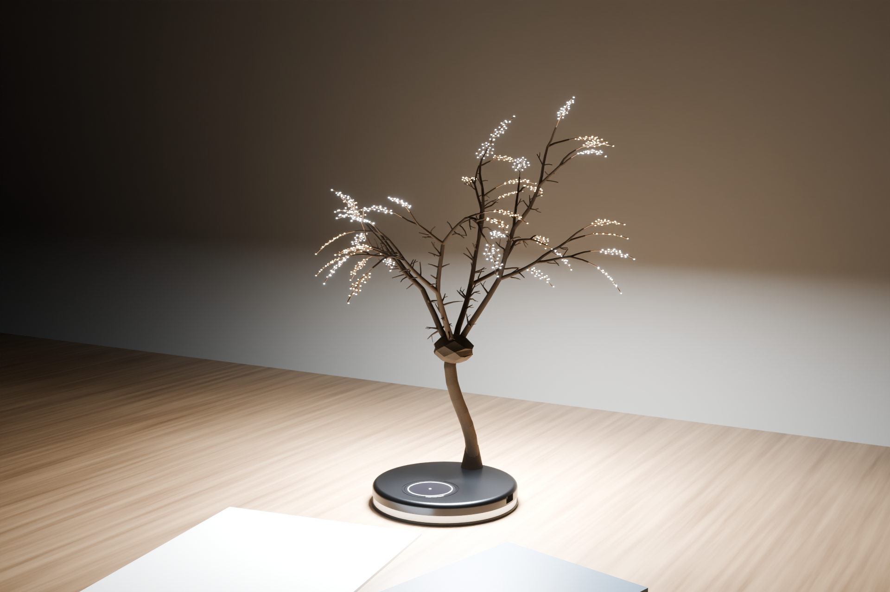
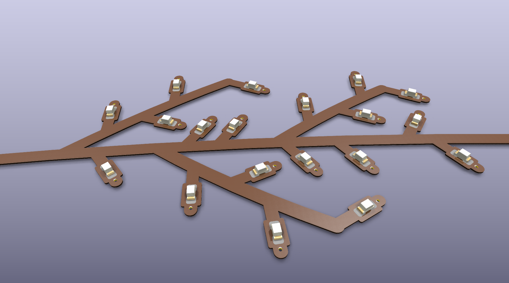
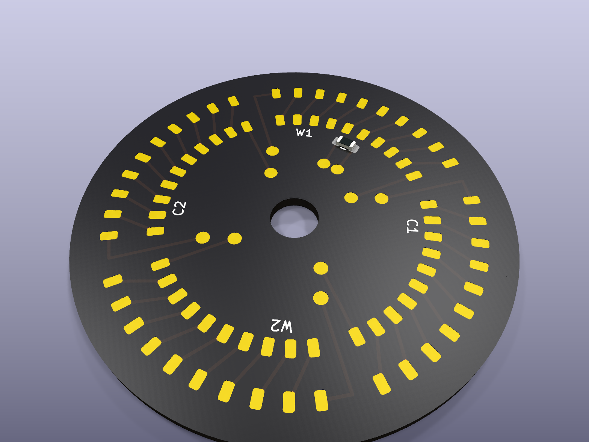

# ECLIPSE Tree: a cedar-elm desk lamp whose leaves are LEDs


ECLIPSE Tree is a small cedar elm (*Ulmus crassifolia*) in patinated brass. Its 800 leaves
are tiny 0402 LEDs. An S-curved trunk rises from a weighted base and forks at a bronze burl
into four limbs. Those limbs divide again and again into 75 branches and 189 fine
spur twigs. At the end of every twig sits a cedar-elm spray: a thin bronze flex circuit
with a main stem, three side shoots and 20 LED leaves. Warm (2700 K) and cool (6500 K)
sprays are interleaved through the whole crown, so the light can be mixed from candle-warm
to daylight. The base keeps the touch glass and the band of light-diffusing opal at its
foot, which now glows like light around the roots.

| | |
|---|---|
|  |  |
|  |  |
|  |  |

## How it works

```
 800 leaves = 40 sprigs x 20 LEDs (0402)        each sprig: 20 LEDs in parallel (~5 mA each)
                │
   magnet-wire pairs laid in the branch grooves (80 x 0.15 mm)
                │
   HUB board in the burl ── chains each colour's 10 sprigs in SERIES (~29 V)
                │            W1 · C1 · W2 · C2   (+ crown NTC)
   10-wire harness down the trunk (same pinout as before)
                │
   CORE board in the base ── USB-C PD 9 V → 4 × TPS61165 boost CC drivers @ 100 mA
                             ATtiny1616: touch wheel, warm/cool mix, root-glow LEDs
```

* **Series of parallel groups.** 100 mA per channel splits across a sprig's 20 leaves (about
  5 mA each). Ten sprigs in series come to ≈29 V, inside the TPS61165's 38 V limit. A failed
  LED only dims its own sprig and the rest of the chain stays lit.
* **The tree is the wiring.** Each sprig's root is crimped to its twig tip. Its two magnet
  wires follow the branches in a fine groove under the patina, back to the hub hidden in the
  burl. Only 10 wires run down the trunk.

## Key specs

| | |
|---|---|
| Overall height | ≈410 mm (top of crown) |
| Crown | ≈345 × 395 mm, 4 limbs, 75 branches + 189 spur twigs (4.7 m of brass), 40 LED sprays (procedurally generated, seeded, reproducible) |
| Leaves | 800 × 0402 white LEDs: 400 × 2700 K + 400 × 6500 K, interleaved by sprig |
| Light | 11.4 W LED power max (capped at ≈8.5 W), ≈450-550 lm (estimated), flicker-free analogue dimming, 2700-6500 K |
| Base | Ø150 × 22 mm: graphite 6061 shell with touch glass, opal root-glow band, steel plinth + white steel reflector |
| Mass / stability | ≈1.67 kg, centre of gravity 8 mm from the base centre; ≈11 N on the outermost twig to tip it |
| Finish | Brass + silicon-bronze, grey-brown liver-of-sulphur bark patina, bronze flex coverlay |
| Power / controls | USB-C PD 9 V (18 W+ charger), capacitive wheel through 3 mm glass: brightness, colour temperature, night root-glow |

## What's in this folder

```
eclipse-lamp/
├── mechanical/
│   ├── tree_gen.py          ← procedural cedar-elm skeleton (branches, spurs, sprig placement, channel mapping)
│   ├── eclipse_cad.py       ← CadQuery model of the base + tree (uses tree_gen)
│   └── out/                 ← STEP/STL per part (big STEPs zipped), assembly STEP, parts.json (skeleton + 800 leaves)
├── electronics/
│   ├── core/   KiCad 9: base board (power, 4 drivers, touch MCU, root glow), unchanged circuit
│   ├── hub/    KiCad 9: Ø36 hub in the burl, 40 sprig lands + series chaining + NTC
│   ├── sprig/  KiCad 9: 2-layer polyimide flex cedar-elm spray, 20 × 0402 LED leaves
│   │   └── */fab/           ← gerbers (zip), drill, pick & place, schematic/layout PDF, ERC/DRC reports
│   ├── lib/                 ← custom footprints (touch electrodes, sprig root, hub lands) + 3D models
│   └── tools/               ← generators: schematics (wire router), PCBs, sprig_layout, hub_layout, checks
├── bom/                     ← eclipse_bom.csv, BOM.md (≈$72 material at 1k units, estimates)
├── renders/                 ← Cycles renders + KiCad 3D board renders, render script
└── docs/DESIGN.md           ← design notes, calculations, wiring map, assembly, open items
```

## Verification

Every schematic draws all signal connections as visible wires: there are no net labels;
power uses power symbols only (see `/CLAUDE.md`).

| Check | Core | Hub | Sprig |
|---|---|---|---|
| ERC | 0 / 0 | 0 / 0 | 0 / 0 |
| DRC | 0 violations | 0 violations | 0 violations |
| Unrouted | 0 | 0 | 0 |
| Schematic ↔ PCB parity | 0 issues | 0 issues | 0 issues |
| Netlist vs design intent | 0 mismatches | 0 mismatches | 0 mismatches |

## Rebuild everything

Requires KiCad 9 (`kicad-cli` + `pcbnew` Python), CadQuery 2.x, shapely, Freerouting 1.9
(core board only, Java 21 + `xvfb-run`) and the `bpy` 5.x module for renders.

```sh
cd electronics/tools
python3 make_footprints.py && python3 make_3d_models.py
for b in core hub sprig; do
  python3 design_$b.py ../$b/eclipse-$b.kicad_sch
  (cd ../$b && kicad-cli sch export netlist --format kicadsexpr -o eclipse-$b.net eclipse-$b.kicad_sch)
  python3 verify_netlist.py design_$b ../$b/eclipse-$b.net
done
python3 pcb_hub.py && python3 pcb_sprig.py   # parametric layouts
./route_core.sh                             # core: placement → Freerouting → pours → DRC
./export_fab.sh                             # gerbers, drill, P&P, PDFs, STEP/GLB, reports
cd ../../mechanical && python3 eclipse_cad.py
cd ../bom && python3 make_bom.py
cd ../renders && python3 render_blender.py hero   # hero | cool | studio | leaves | night | detail
```

See [docs/DESIGN.md](docs/DESIGN.md) for the details and the open items to resolve before
building one.
