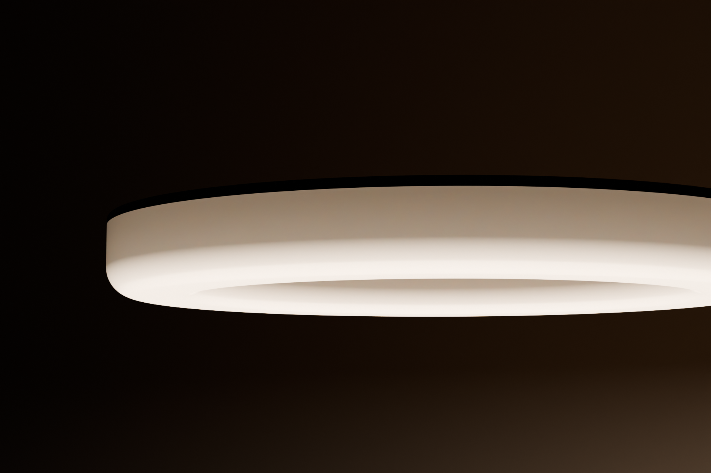
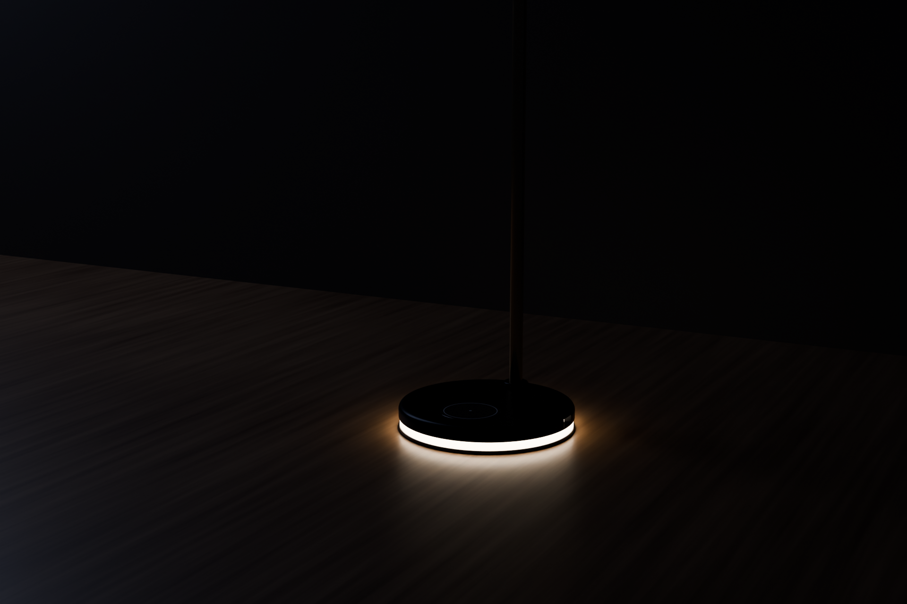

# ECLIPSE: a desk lamp that glows through its body


ECLIPSE has no lampshade and no visible light source. **The light comes out through the
body of the lamp itself.** The 212 mm halo is a moulded ring of light-diffusing acrylic
under a thin graphite cap. Forty LEDs fire down into it, and the light scatters through the
material. The underside gives an even, bright task light, while the walls glow softly and
fade toward the dark cap, like the corona around an eclipsed sun. The weighted base works
the same way: a band of the same opal material sits between the graphite shell and the
plinth and glows from a light chamber inside, either as a breathing night-light or as
touch feedback.

| | |
|---|---|
|  |  |
|  |  |
|  |  |

## How the light gets through the body

```
            graphite cap (heatsink, blocks up-light)
   ┌───────────────────────────────────────────────┐
   │ ▓▓▓▓▓ halo PCB, 40 LEDs firing DOWN ▓▓▓▓▓▓▓▓▓ │
   ├──┐                                         ┌──┤
   │  │   air light-mixing chamber (15 mm)       │  │  ← 5.4 mm diffusing walls:
   │  │                                          │  │    soft side glow, fading upward
   │  └──────────────────────────────────────────┘  │
   ╰──────── 4 mm diffusing floor: task light ──────╯  ← brightest face
```

The base uses the same idea in miniature: 8 warm 2835 LEDs on the rim of the core board fire
down onto the white powder-coated steel weight. The light bounces around that chamber and
leaves through the 7 mm opal band.

## Key specs

| | |
|---|---|
| Overall height | 449 mm (top of hinge knuckle) |
| Reach | Halo centre 158 mm in front of the base centre |
| Halo | Ø212 / Ø148 × 25 mm: a 22 mm hollow light-diffusing PMMA body plus a 3 mm graphite cap, tilt ±30° on a friction hinge |
| Base | Ø150 × 22 mm: graphite 6061 shell, Ø148 × 7 mm glowing opal band, steel plinth, white steel reflector/weight |
| Mass / stability | ≈1.69 kg. The CoG sits 40 mm behind the base's front edge, so tipping it needs about 8 N pressed on the halo |
| Light source | 40 × Luminus MP-3030-1100, CRI 90: 20 × 2700 K + 20 × 6500 K, interleaved |
| Drive | 4 strings × 10 LEDs at 100 mA constant current (4 × TPS61165 boost) |
| LED power | 11.6 W max. Firmware caps it at about 8.5 W, which is roughly 650-750 lm out of the body (estimated) |
| Body glow (base) | 8 × 2835 2700 K at about 5 mA, PWM night-glow / feedback (≈0.13 W) |
| CCT | 2700-6500 K continuous (warm/cool mixing), flicker-free analogue dimming |
| Power | USB-C PD sink at 9 V (CH224K). Needs an 18 W+ charger. A plain 5 V port falls back to reduced brightness |
| Controls | Capacitive touch through 3 mm glass. Tap the centre key for on/off, slide the wheel for brightness, hold the key and slide for colour temperature. Double-tap toggles the night-glow |
| Protection | 1.5 A PTC fuse, 15 V TVS, LED open-string OVP (38 V), NTC derating on the halo (>60 °C) |

## What's in this folder

```
eclipse-lamp/
├── README.md                ← you are here
├── mechanical/
│   ├── eclipse_cad.py       ← parametric CadQuery model (all parts)
│   └── out/                 ← STEP + STL per part, eclipse_lamp_assembly.step, parts.json
├── electronics/
│   ├── core/                ← KiCad 9 project: base board (power, drivers, touch MCU)
│   │   ├── eclipse-core.kicad_sch / .kicad_pcb / .kicad_pro / .step / .glb
│   │   └── fab/             ← gerbers (zip), drill, pick&place, schematic + layout PDFs, ERC/DRC reports
│   ├── halo/                ← KiCad 9 project: 40-LED ring board
│   │   └── fab/
│   ├── lib/                 ← custom footprints (touch wheel/key) + 3D models (3030 LED, JST PH SMD)
│   └── tools/               ← generators: schematic (with wire router), PCB placement/routing, checks
├── bom/
│   ├── eclipse_bom.csv      ← full BOM (electronics from KiCad + mechanical), with cost estimates
│   ├── BOM.md               ← same, readable
│   └── make_bom.py
├── renders/                 ← Blender/Cycles renders + KiCad 3D board renders, render script
└── docs/DESIGN.md           ← design notes, calculations, pin map, assembly, open items
```

## Electronics at a glance

**Core board** (in the base): a Ø124 mm round board with a USB-C tab. It's 2-layer and
single-sided assembly on the **bottom**. The top face presses against the underside of the
touch glass and carries only the copper touch electrodes and the glow LED.

* USB-C → PTC fuse + TVS → **CH224K** asks the charger for 9 V (CFG1 = 6.8 k)
* 4 × **TPS61165** boost CC drivers, one per string. A 2.0 Ω sense resistor sets 100 mA,
  and PWM on CTRL gives analogue (flicker-free) dimming
* **ATtiny1616**: PTC self-capacitance touch (key + 3-segment wheel), TCA0 PWM for the warm
  and cool channels, VIN sense, NTC read-back, UPDI programming pads
* **Body glow**: 8 × 2835 warm LEDs around the board rim, switched by an AO3400A from
  PC0 (TCD0 PWM), light the base's opal band through the internal light chamber
* AMS1117-3.3 logic supply, JST-PH 10-pin harness to the halo through the stem

**Halo board** (in the ring): a 200/160 mm annulus. All copper is on one layer, so it can be
built as an aluminium MCPCB. 40 LEDs are laid out mirror-symmetrically about the hinge. Each
half of the ring carries one warm and one cool string. The warm strings detour inside the LEDs
and the cool strings outside them, and the return lanes run along the board edges, so nothing
crosses and no vias are needed.

Both schematics are drawn with **real wires for every signal connection**. Only power rails
use power symbols.

| Check | Core | Halo |
|---|---|---|
| ERC | 0 errors / 0 warnings | 0 / 0 |
| DRC | 0 violations | 0 violations |
| Unrouted | 0 | 0 |
| Schematic ↔ PCB parity | 0 issues | 0 issues |
| Netlist vs design intent (`verify_netlist.py`) | 0 mismatches | 0 mismatches |


## Rebuild everything

Requires KiCad 9 (`kicad-cli` + `pcbnew` Python), CadQuery 2.x, Freerouting 1.9 (Java 21,
`xvfb-run`) and the `bpy` 5.x module for renders.

```sh
cd electronics/tools
python3 make_footprints.py && python3 make_3d_models.py
python3 design_core.py ../core/eclipse-core.kicad_sch     # schematic (+ wire routing)
python3 design_halo.py ../halo/eclipse-halo.kicad_sch
(cd ../core && kicad-cli sch export netlist --format kicadsexpr -o eclipse-core.net eclipse-core.kicad_sch)
(cd ../halo && kicad-cli sch export netlist --format kicadsexpr -o eclipse-halo.net eclipse-halo.kicad_sch)
python3 verify_netlist.py design_core ../core/eclipse-core.net
python3 verify_netlist.py design_halo ../halo/eclipse-halo.net
python3 pcb_halo.py                   # ring board: parametric placement + routing
./route_core.sh                       # core board: placement → Freerouting → pours → DRC
./export_fab.sh                       # gerbers, drill, P&P, PDFs, STEP/GLB, reports
cd ../../mechanical && python3 eclipse_cad.py
cd ../bom && python3 make_bom.py
cd ../renders && python3 render_blender.py hero   # hero | studio | glow | night | detail | underside | exploded
```

See [docs/DESIGN.md](docs/DESIGN.md) for the design rationale, the calculations and the
open items to resolve before a production run.
