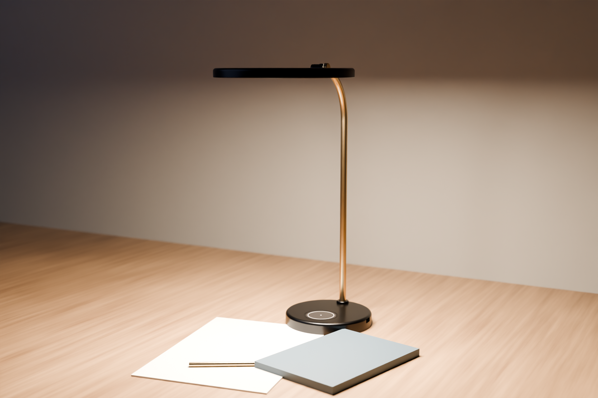
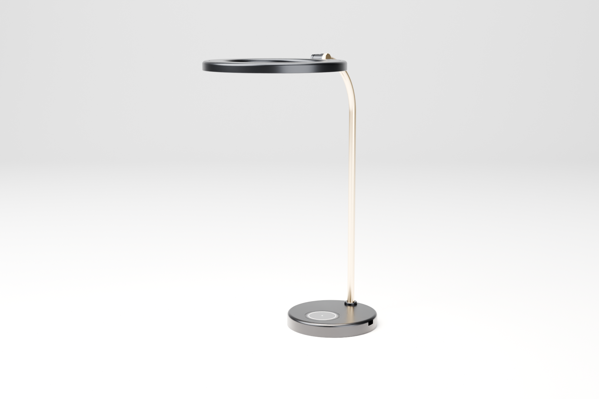
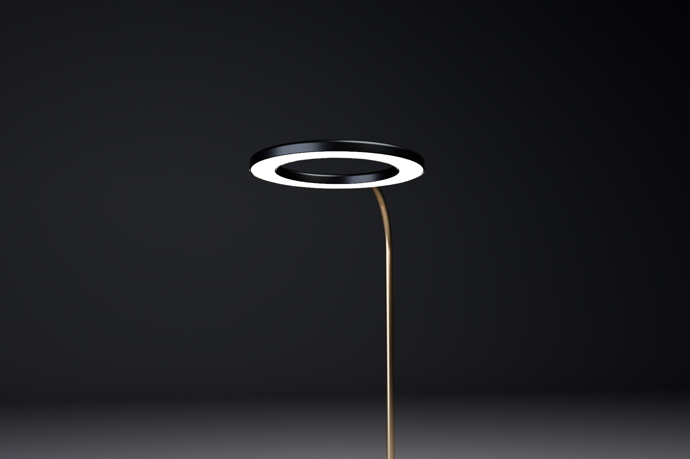
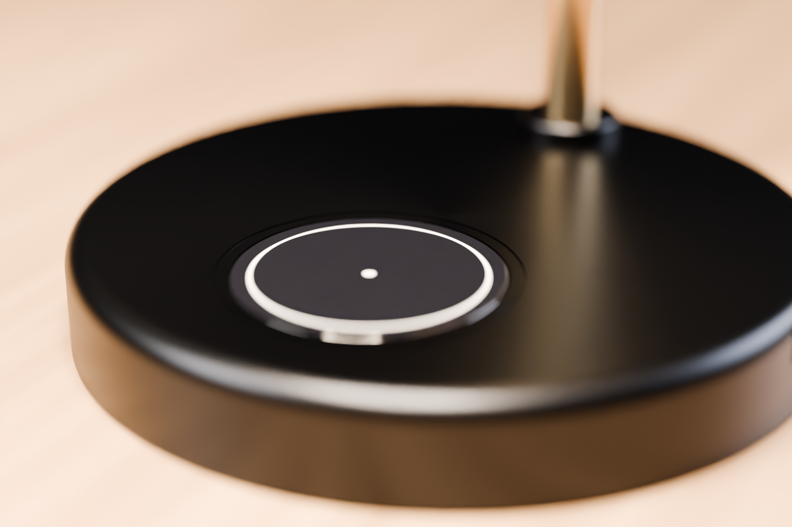
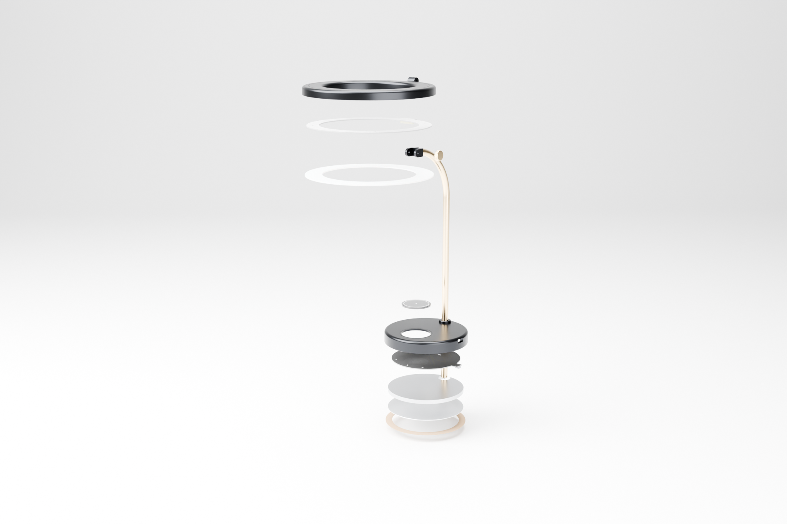
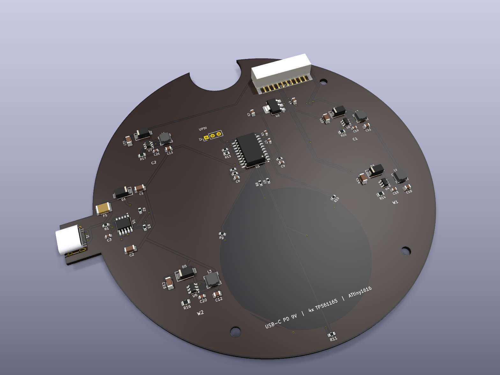
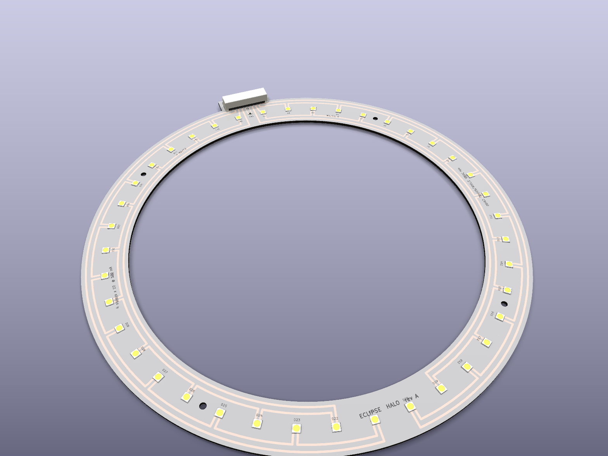

# ECLIPSE: cantilevered halo desk lamp



ECLIPSE is a desk lamp built around a thin graphite ring of light that floats in front
of a single brass arc. The ring is a 212 mm aluminium halo hanging from a friction hinge.
It has no visible light source, only a continuous opal line of tunable-white light that
throws an even, shadow-softened pool onto the desk. The centre of the ring is open, so
you look through the lamp rather than at it. The weighted base carries
a flush glass touch window with a capacitive wheel for brightness and colour temperature.

| | |
|---|---|
|  |  |
|  |  |

## Key specs

| | |
|---|---|
| Overall height | 449 mm (top of hinge knuckle) |
| Reach | Halo centre 158 mm in front of the base centre |
| Halo | Ø212 / Ø148 × 14 mm, tilt ±30° on a friction hinge |
| Base | Ø150 × 22 mm, graphite anodised 6061 with an 0.8 kg steel weight |
| Mass / stability | ≈1.55 kg. The CoG sits 50 mm behind the base's front edge, so tipping it needs about 9 N pressed on the halo |
| Light source | 40 × Luminus MP-3030-1100, CRI 90: 20 × 2700 K + 20 × 6500 K, interleaved |
| Drive | 4 strings × 10 LEDs at 100 mA constant current (4 × TPS61165 boost) |
| LED power | 11.6 W max. Firmware caps it at about 8.5 W, which is roughly 750-850 lm out of the diffuser (estimated) |
| CCT | 2700-6500 K continuous (warm/cool mixing), flicker-free analogue dimming |
| Power | USB-C PD sink at 9 V (CH224K). Needs an 18 W+ charger. A plain 5 V port falls back to reduced brightness |
| Controls | Capacitive touch through 3 mm glass. Tap the centre key for on/off, slide the wheel for brightness, hold the key and slide for colour temperature. A glow dot gives feedback |
| Protection | 1.5 A PTC fuse, 15 V TVS, LED open-string OVP (38 V), NTC derating on the halo (>65 °C) |

## What's in this folder

```
eclipse-lamp/
├── README.md                ← you are here
├── mechanical/
│   ├── eclipse_cad.py       ← parametric CadQuery model (all parts)
│   └── out/                 ← STEP + STL per part, eclipse_lamp_assembly.step, parts.json
├── electronics/
│   ├── core/                ← KiCad 9 project: base board (power, drivers, touch MCU)
│   │   ├── eclipse-core.kicad_sch / .kicad_pcb / .kicad_pro / .step / .glb
│   │   └── fab/             ← gerbers (zip), drill, pick&place, schematic + layout PDFs, ERC/DRC reports
│   ├── halo/                ← KiCad 9 project: 40-LED ring board
│   │   └── fab/
│   ├── lib/                 ← custom footprints (touch wheel/key) + 3D models (3030 LED, JST PH SMD)
│   └── tools/               ← generators: schematic (with wire router), PCB placement/routing, checks
├── bom/
│   ├── eclipse_bom.csv      ← full BOM (electronics from KiCad + mechanical), with cost estimates
│   ├── BOM.md               ← same, readable
│   └── make_bom.py
├── renders/                 ← Blender/Cycles renders + KiCad 3D board renders, render script
└── docs/DESIGN.md           ← design notes, calculations, pin map, assembly, open items
```

## Electronics at a glance

**Core board** (in the base): a Ø124 mm round board with a USB-C tab. It's 2-layer and
single-sided assembly on the **bottom**. The top face presses against the underside of the
touch glass and carries only the copper touch electrodes and the glow LED.

* USB-C → PTC fuse + TVS → **CH224K** asks the charger for 9 V (CFG1 = 6.8 k)
* 4 × **TPS61165** boost CC drivers, one per string. A 2.0 Ω sense resistor sets 100 mA,
  and PWM on CTRL gives analogue (flicker-free) dimming
* **ATtiny1616**: PTC self-capacitance touch (key + 3-segment wheel), TCA0 PWM for the warm
  and cool channels, VIN sense, NTC read-back, UPDI programming pads
* AMS1117-3.3 logic supply, JST-PH 10-pin harness to the halo through the stem

**Halo board** (in the ring): a 200/160 mm annulus. All copper is on one layer, so it can be
built as an aluminium MCPCB. 40 LEDs are laid out mirror-symmetrically about the hinge. Each
half of the ring carries one warm and one cool string. The warm strings detour inside the LEDs
and the cool strings outside them, and the return lanes run along the board edges, so nothing
crosses and no vias are needed.

Both schematics are drawn with **real wires for every signal connection**. Only power rails
use power symbols.

| Check | Core | Halo |
|---|---|---|
| ERC | 0 errors / 0 warnings | 0 / 0 |
| DRC | 0 violations | 0 violations |
| Unrouted | 0 | 0 |
| Schematic ↔ PCB parity | 0 issues | 0 issues |
| Netlist vs design intent (`verify_netlist.py`) | 0 mismatches | 0 mismatches |




## Rebuild everything

Requires KiCad 9 (`kicad-cli` + `pcbnew` Python), CadQuery 2.x, Freerouting 1.9 (Java 21,
`xvfb-run`) and the `bpy` 5.x module for renders.

```sh
cd electronics/tools
python3 make_footprints.py && python3 make_3d_models.py
python3 design_core.py ../core/eclipse-core.kicad_sch     # schematic (+ wire routing)
python3 design_halo.py ../halo/eclipse-halo.kicad_sch
(cd ../core && kicad-cli sch export netlist --format kicadsexpr -o eclipse-core.net eclipse-core.kicad_sch)
(cd ../halo && kicad-cli sch export netlist --format kicadsexpr -o eclipse-halo.net eclipse-halo.kicad_sch)
python3 verify_netlist.py design_core ../core/eclipse-core.net
python3 verify_netlist.py design_halo ../halo/eclipse-halo.net
python3 pcb_halo.py                   # ring board: parametric placement + routing
./route_core.sh                       # core board: placement → Freerouting → pours → DRC
./export_fab.sh                       # gerbers, drill, P&P, PDFs, STEP/GLB, reports
cd ../../mechanical && python3 eclipse_cad.py
cd ../bom && python3 make_bom.py
cd ../renders && python3 render_blender.py hero   # hero | studio | detail | underside | exploded
```

See [docs/DESIGN.md](docs/DESIGN.md) for the design rationale, the calculations and the
open items to resolve before a production run.
